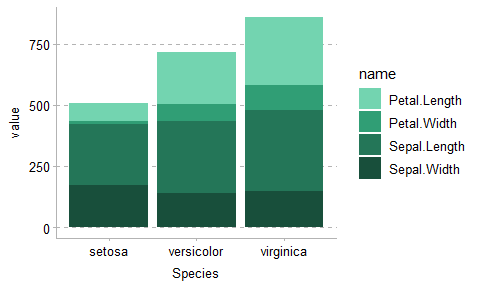
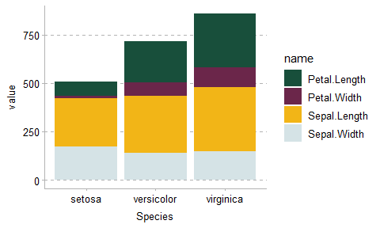
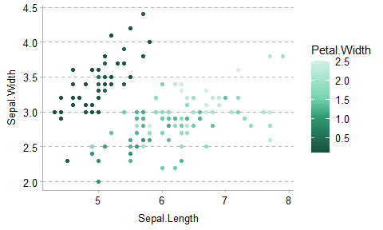

<!-- README.md is generated from README.Rmd. Please edit that file -->

# ggIFS

<!-- badges: start -->

<!-- badges: end -->

## Installation

You can install the development version of ggIFS from
[GitHub](https://github.com/) with:

``` r
# install.packages("devtools")
devtools::install_github("vedanthnair/ggIFS")
```

## Example

This is an example which applies the IFS theme and colour to a bar plot.
Iris is a default dataset that comes with most distributions of R.

``` r
# Creating an example dataframe, which has the mean variable for each species
iris_clean <- iris %>%
  group_by(Species) %>%
  summarize(across(.cols = everything(), mean, na.rm = T)) %>% 
  pivot_longer(cols = !Species) %>%
  arrange(name)

iris_clean
#> # A tibble: 12 x 3
#>    Species    name         value
#>    <fct>      <chr>        <dbl>
#>  1 setosa     Petal.Length 1.46 
#>  2 versicolor Petal.Length 4.26 
#>  3 virginica  Petal.Length 5.55 
#>  4 setosa     Petal.Width  0.246
#>  5 versicolor Petal.Width  1.33 
#>  6 virginica  Petal.Width  2.03 
#>  7 setosa     Sepal.Length 5.01 
#>  8 versicolor Sepal.Length 5.94 
#>  9 virginica  Sepal.Length 6.59 
#> 10 setosa     Sepal.Width  3.43 
#> 11 versicolor Sepal.Width  2.77 
#> 12 virginica  Sepal.Width  2.97
```

Without putting in any arguments, scale_fill_ifs() (we are using fill
because we want a bar chart), will automatically apply the IFS standard
colour palette (mid-primary colours).

```{r}
ggplot(iris_clean) +
  geom_bar(aes(x = Species, y = value, fill = name), stat = "identity") +
  theme_ifs() +
  scale_fill_ifs()

```

We can choose a custom palette, e.g. greens. Palettes can be greens,
greys, yellows, reds, blues, purples.

```{r}
ggplot(iris_clean) +
  geom_bar(aes(x = Species, y = value, fill = name), stat = "identity") +
  theme_ifs() +
  scale_fill_ifs(palette = "greens")
```



We can choose custom colour values, using the 'values' argument. The
potential values are dark_X\_2, dark_X\_1, mid_X, light_X\_1,
light_X\_2, light_X\_3, substituting X for green, grey, yellow, red,
blue or purple (following the IFS naming convention.)

``` r
ggplot(iris_clean) +
  geom_bar(aes(x = Species, y = value, fill = name), stat = "identity") +
  theme_ifs() +
  scale_fill_ifs(values = c("dark_green_2", "dark_green_1", "mid_yellow", "mid_red"))
```



If you want even more control, you can

You can also add gradients, in which case the palette or user-specified
values are taken as start, end and mid points of the gradient.

``` r
ggplot(iris) +
  geom_point(aes(x = Sepal.Length, y = Sepal.Width, col = Petal.Width)) +
  theme_ifs() +
  scale_colour_ifs(palette = "greens", gradient = TRUE)
```



## 
